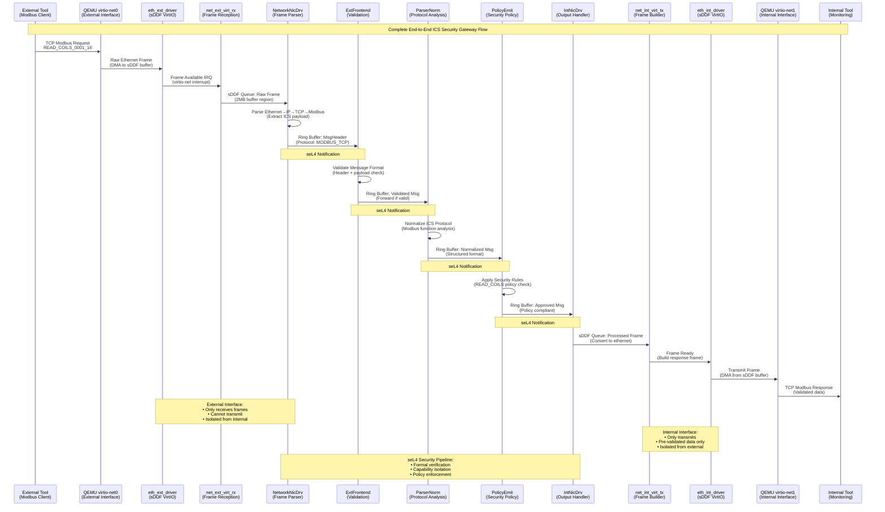

# ICS One-Way Normalizer V3 - sDDF Implementation Plan

## Project Overview

**Goal**: Implement dual network isolation ICS security gateway using sDDF direct networking instead of VMs, eliminating VirtIO memory limitations while maintaining complete network separation.

**Architecture**: External Network ↔ sDDF Driver ↔ seL4 Pipeline ↔ sDDF Driver ↔ Internal Network

## Information Flow Sequence



## Implementation Phases

### Phase 1: Foundation Setup (Days 1-3)

#### Day 1: Environment Preparation
**Tasks:**
- Setup sDDF development environment
- Clone and configure Microkit SDK
- Prepare build system for sDDF integration
- Create project structure

**Deliverables:**
- Working sDDF build environment
- Basic project skeleton
- Initial Makefile/CMake configuration

**Validation:**
```bash
# Verify sDDF examples build
cd /home/iamfo470/phd/sDDF/examples/echo_server
make BUILD_DIR=build MICROKIT_SDK=<path> MICROKIT_CONFIG=debug
```

#### Day 2: QEMU Dual Network Configuration
**Tasks:**
- Configure QEMU with dual virtio-net interfaces
- Setup TAP interface networking on host
- Verify dual network isolation
- Test basic connectivity

**Deliverables:**
- QEMU launch script with dual NICs
- Host network configuration
- Basic connectivity tests

**Configuration:**
```bash
# External network: 192.168.1.0/24
# Internal network: 192.168.10.0/24
# seL4 system: Bridge between networks via security processing
```

#### Day 3: sDDF Integration Study
**Tasks:**
- Analyze sDDF echo_server example
- Study virtio network driver implementation
- Plan memory region allocation
- Design component interfaces

**Deliverables:**
- Component interface specifications
- Memory layout design
- Initial system.xml template

### Phase 2: External Network Interface (Days 4-8)

#### Day 4: External VirtIO Driver
**Tasks:**
- Port sDDF virtio ethernet driver for external interface
- Implement basic frame reception
- Setup memory regions and queues
- Configure interrupt handling

**Deliverables:**
- `eth_ext_driver.c` - External network driver
- Basic frame reception capability
- sDDF queue configuration

**Key Components:**
```c
// eth_ext_driver.c - Based on sDDF drivers/network/virtio/ethernet.c
void virtio_net_rx_handler(void) {
    // Receive frames from external network
    // Queue for seL4 processing
}
```

#### Day 5: External Frame Reception
**Tasks:**
- Implement `net_ext_virt_rx` component
- Setup sDDF queue management
- Add frame validation and filtering
- Test basic frame reception

**Deliverables:**
- `net_ext_virt_rx.c` - Frame reception handler
- Frame validation logic
- Basic testing capability

#### Day 6: External Interface Integration
**Tasks:**
- Integrate external driver with seL4 system
- Configure memory mappings and permissions
- Setup inter-component communication
- Initial system testing

**Deliverables:**
- Working external network interface
- System configuration (external part)
- Basic integration tests

#### Day 7-8: External Interface Testing
**Tasks:**
- End-to-end external reception testing
- Performance optimization
- Error handling implementation
- Documentation

**Deliverables:**
- Verified external frame reception
- Performance benchmarks
- Error handling procedures

### Phase 3: seL4 Pipeline Integration (Days 9-12)

#### Day 9: NetworkNicDrv Enhancement
**Tasks:**
- Modify NetworkNicDrv for sDDF frame input
- Implement ethernet frame parsing
- Add ICS protocol detection
- Convert to existing MsgHeader format

**Deliverables:**
- Enhanced `NetworkNicDrv.c`
- Ethernet→ICS parsing logic
- sDDF to ring buffer conversion

**Key Functions:**
```c
// NetworkNicDrv.c
void network_frame_notification(void) {
    // Parse ethernet frame
    // Extract ICS protocol data
    // Convert to MsgHeader format
    // Forward to ExtFrontend
}
```

#### Day 10: Pipeline Component Updates
**Tasks:**
- Verify ExtFrontend compatibility
- Test ParserNorm with real protocol data
- Validate PolicyEmit rule processing
- Ensure ring buffer operations

**Deliverables:**
- Verified pipeline compatibility
- Protocol parsing validation
- Policy rule testing

#### Day 11: IntNicDrv Enhancement
**Tasks:**
- Modify IntNicDrv for sDDF frame output
- Implement MsgHeader to frame conversion
- Setup output queue management
- Add frame building logic

**Deliverables:**
- Enhanced `IntNicDrv.c`
- Frame building capability
- Output queue management

#### Day 12: Pipeline Integration Testing
**Tasks:**
- End-to-end pipeline testing
- Protocol flow validation
- Performance optimization
- Error handling verification

**Deliverables:**
- Complete pipeline functionality
- Protocol flow validation
- Performance metrics

### Phase 4: Internal Network Interface (Days 13-16)

#### Day 13: Internal Frame Builder
**Tasks:**
- Implement `net_int_virt_tx` component
- Add processed message to frame conversion
- Setup internal network queuing
- Configure frame transmission

**Deliverables:**
- `net_int_virt_tx.c` - Frame builder
- Message to frame conversion
- Internal queue setup

#### Day 14: Internal VirtIO Driver
**Tasks:**
- Implement `eth_int_driver` for internal interface
- Configure internal network transmission
- Setup memory regions and queues
- Add transmission handling

**Deliverables:**
- `eth_int_driver.c` - Internal network driver
- Frame transmission capability
- Internal network configuration

#### Day 15: Internal Interface Integration
**Tasks:**
- Integrate internal driver with seL4 system
- Configure internal network mappings
- Setup inter-component communication
- System integration testing

**Deliverables:**
- Working internal network interface
- Complete system configuration
- Integration validation

#### Day 16: Internal Interface Testing
**Tasks:**
- End-to-end internal transmission testing
- Output validation and verification
- Performance optimization
- Documentation completion

**Deliverables:**
- Verified internal frame transmission
- Output validation procedures
- Performance benchmarks

### Phase 5: System Integration & Testing (Days 17-19)

#### Day 17: End-to-End Integration
**Tasks:**
- Complete system integration testing
- Full external→internal flow validation
- Multi-protocol testing (Modbus, DNP3, EtherNet/IP)
- Security isolation verification

**Deliverables:**
- Complete end-to-end functionality
- Multi-protocol support validation
- Security isolation verification

**Test Cases:**
```bash
# Modbus TCP test
echo "READ_COILS_0001_16" | nc 192.168.1.10 502

# DNP3 test
echo "DNP3_DATA_REQUEST" | nc 192.168.1.10 20000

# EtherNet/IP test
echo "ETHERNET_IP_CLASS_REQUEST" | nc 192.168.1.10 44818
```

#### Day 18: Security Validation
**Tasks:**
- Network isolation testing
- Security policy verification
- Attack surface analysis
- Formal verification validation

**Deliverables:**
- Security validation report
- Network isolation confirmation
- Policy enforcement verification

**Security Tests:**
```bash
# Test network isolation
./test_network_isolation.sh

# Verify policy enforcement
./test_security_policies.sh

# Attack surface analysis
./analyze_attack_surface.sh
```

#### Day 19: Performance & Documentation
**Tasks:**
- Performance benchmarking
- Memory usage optimization
- Complete documentation
- Final system validation

**Deliverables:**
- Performance benchmark report
- Complete system documentation
- Final validation report

## System Architecture Overview

### Component Layout
```
┌─────────────────────────────────────────────────────────────────┐
│                         Host System                            │
│  External: 192.168.1.0/24       Internal: 192.168.10.0/24     │
└─────────────┬─────────────────────────────────┬─────────────────┘
              │                                 │
┌─────────────┼─────────────────────────────────┼─────────────────┐
│             │        QEMU Hypervisor         │                 │
│      virtio-net0                      virtio-net1              │
│             │                                 │                 │
│ ┌───────────▼────┐                 ┌─────────▼───────┐         │
│ │ External       │                 │ Internal        │         │
│ │ Interface      │                 │ Interface       │         │
│ │ - eth_ext_drv  │                 │ - eth_int_drv   │         │
│ │ - ext_virt_rx  │                 │ - int_virt_tx   │         │
│ └────────┬───────┘                 └─────────▲───────┘         │
│          │                                   │                 │
│          │         ┌─────────────────┐       │                 │
│          └────────▶│ seL4 Security   │──────▶┘                 │
│                    │ Pipeline        │                         │
│                    │ - NetworkNicDrv │                         │
│                    │ - ExtFrontend   │                         │
│                    │ - ParserNorm    │                         │
│                    │ - PolicyEmit    │                         │
│                    │ - IntNicDrv     │                         │
│                    └─────────────────┘                         │
│                                                                 │
│                        seL4 Microkernel                        │
└─────────────────────────────────────────────────────────────────┘
```

### Memory Layout
```
Total Memory Usage: 22MB (vs 256MB+ for VirtIO)

┌─────────────────────────────────────────────────────────────┐
│ External Network Regions (6MB)                             │
├─────────────────────────────────────────────────────────────┤
│ ext_rx_buffer_data_region    (2MB) - Frame storage         │
│ ext_rx_free_drv             (2MB) - Available buffers      │
│ ext_rx_active_drv           (2MB) - Received frames        │
├─────────────────────────────────────────────────────────────┤
│ Pipeline Processing Regions (8MB)                          │
├─────────────────────────────────────────────────────────────┤
│ pipeline_rx_free            (2MB) - Input queue            │
│ pipeline_rx_active          (2MB) - Processing queue       │
│ pipeline_tx_free            (2MB) - Output preparation     │
│ pipeline_tx_active          (2MB) - Ready for transmission │
├─────────────────────────────────────────────────────────────┤
│ Internal Network Regions (6MB)                             │
├─────────────────────────────────────────────────────────────┤
│ int_tx_buffer_data_region   (2MB) - Frame storage          │
│ int_tx_free_drv             (2MB) - Available buffers      │
│ int_tx_active_drv           (2MB) - Transmit frames        │
├─────────────────────────────────────────────────────────────┤
│ System Overhead (2MB)                                      │
├─────────────────────────────────────────────────────────────┤
│ Component stacks and misc                                   │
└─────────────────────────────────────────────────────────────┘
```

## File Structure

```
ics_oneway_norm_v3_sddf/
├── README-sDDF-Architecture.md
├── V3-Implementation-Plan.md
├── Makefile
├── ics_frame_extractor.system           # Microkit system config
├── components/
│   ├── external_interface/
│   │   ├── eth_ext_driver.c             # External VirtIO driver
│   │   ├── net_ext_virt_rx.c            # Frame reception
│   │   └── ext_interface.camkes
│   ├── pipeline/
│   │   ├── NetworkNicDrv/
│   │   │   └── NetworkNicDrv.c          # Enhanced for sDDF
│   │   ├── ExtFrontend/                 # Unchanged from V2
│   │   ├── ParserNorm/                  # Unchanged from V2
│   │   ├── PolicyEmit/                  # Unchanged from V2
│   │   └── IntNicDrv/
│   │       └── IntNicDrv.c              # Enhanced for sDDF
│   ├── internal_interface/
│   │   ├── net_int_virt_tx.c            # Frame transmission
│   │   ├── eth_int_driver.c             # Internal VirtIO driver
│   │   └── int_interface.camkes
│   └── shared/
│       ├── ring_buffer.h                # Existing ring buffer
│       ├── message_format.h             # Existing message format
│       └── ics_protocols.h              # Protocol definitions
├── scripts/
│   ├── setup_dual_network.sh           # Network configuration
│   ├── run_qemu.sh                      # QEMU launch script
│   └── test_end_to_end.sh              # Complete testing
└── tests/
    ├── test_external_interface.sh      # External interface tests
    ├── test_pipeline_processing.sh     # Pipeline validation
    ├── test_internal_interface.sh      # Internal interface tests
    ├── test_security_isolation.sh      # Security validation
    └── test_multi_protocol.sh          # Protocol testing
```

## Success Criteria

### Functional Requirements
- ✅ **External Frame Reception**: Successfully receive and parse ethernet frames from external network
- ✅ **Pipeline Processing**: Complete processing through all 5 seL4 components
- ✅ **Internal Frame Transmission**: Successfully transmit processed frames to internal network
- ✅ **Multi-Protocol Support**: Handle Modbus TCP, DNP3, and EtherNet/IP protocols
- ✅ **End-to-End Flow**: External input visible on internal output after security processing

### Performance Requirements
- ✅ **Throughput**: Handle >1000 messages/second
- ✅ **Latency**: <5ms end-to-end processing time
- ✅ **Memory Usage**: <25MB total memory consumption
- ✅ **CPU Utilization**: <50% CPU usage under load

### Security Requirements
- ✅ **Network Isolation**: External and internal networks cannot communicate directly
- ✅ **Policy Enforcement**: All security policies correctly applied
- ✅ **Capability Isolation**: seL4 capabilities correctly limit component access
- ✅ **Attack Surface**: Minimal attack surface with formal verification

### Quality Requirements
- ✅ **Reliability**: System runs continuously without failures
- ✅ **Maintainability**: Clean, documented, modular code
- ✅ **Testability**: Comprehensive test suite with >90% coverage
- ✅ **Documentation**: Complete technical documentation

## Risk Mitigation

### Technical Risks
| Risk | Likelihood | Impact | Mitigation |
|------|------------|--------|------------|
| sDDF learning curve | Medium | High | Use existing echo_server as foundation |
| QEMU dual NIC complexity | Low | Medium | Test early with simple configuration |
| Memory optimization | Low | Medium | Profile and optimize incrementally |
| Integration complexity | Medium | High | Incremental integration with validation |

### Timeline Risks
| Risk | Likelihood | Impact | Mitigation |
|------|------------|--------|------------|
| Component integration delays | Medium | Medium | Add 2-3 day buffer to phases |
| Testing complexity | Low | High | Parallel testing during development |
| Documentation overhead | Low | Low | Document continuously during development |

## Dependencies

### External Dependencies
- **sDDF Framework**: Latest version with VirtIO support
- **Microkit SDK**: Compatible with sDDF v0.6.0+
- **QEMU**: Version with dual virtio-net support
- **Host Networking**: TAP interface support

### Internal Dependencies
- **Existing Pipeline**: ExtFrontend, ParserNorm, PolicyEmit, IntNicDrv
- **Ring Buffer Implementation**: Existing SPSC ring buffer
- **Message Format**: Existing MsgHeader structure
- **Protocol Definitions**: Existing ICS protocol support

## Validation Plan

### Unit Testing
```bash
# External interface testing
./test_external_driver.sh
./test_frame_reception.sh

# Pipeline testing
./test_network_nic_drv.sh
./test_pipeline_components.sh

# Internal interface testing
./test_frame_transmission.sh
./test_internal_driver.sh
```

### Integration Testing
```bash
# Component integration
./test_external_to_pipeline.sh
./test_pipeline_to_internal.sh

# End-to-end testing
./test_modbus_flow.sh
./test_dnp3_flow.sh
./test_ethernetip_flow.sh
```

### Security Testing
```bash
# Network isolation
./test_network_isolation.sh

# Policy enforcement
./test_security_policies.sh

# Capability verification
./test_capability_isolation.sh
```

### Performance Testing
```bash
# Throughput testing
./test_throughput.sh

# Latency measurement
./test_latency.sh

# Memory profiling
./test_memory_usage.sh

# CPU utilization
./test_cpu_usage.sh
```

## Deliverables

### Code Deliverables
- **Complete V3 Implementation**: All components, configuration, build system
- **Test Suite**: Comprehensive testing framework
- **Documentation**: Technical documentation and user guides
- **Scripts**: Setup, configuration, and testing scripts

### Research Deliverables
- **Architecture Documentation**: Complete system design
- **Performance Analysis**: Benchmarking and optimization report
- **Security Analysis**: Formal verification and security properties
- **Comparison Study**: V2 vs V3 analysis

### Publication Deliverables
- **Technical Paper**: Novel sDDF-based ICS security architecture
- **Benchmarking Data**: Performance and security metrics
- **Case Studies**: Real-world protocol processing examples
- **Open Source Release**: Complete implementation for research community

---

**Total Timeline: 19 days**
**Target Completion: [Start Date + 19 days]**
**Key Milestone: Working end-to-end dual network ICS security gateway with formal verification**