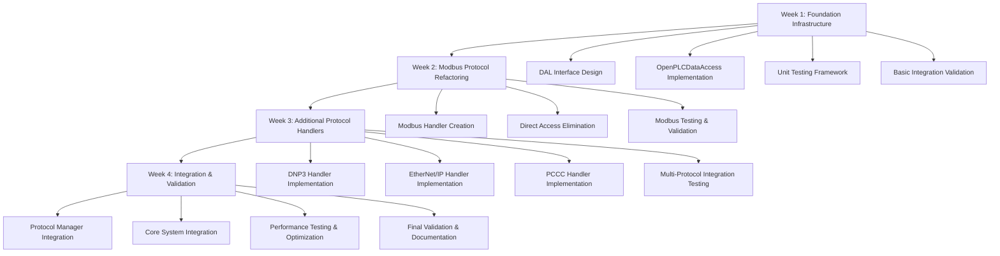

# Phase 1: Implementation Sequence with Dependencies

## Executive Summary

This document provides a **dependency-ordered implementation sequence** for Phase 1 Data Access Layer refactoring. The sequence is designed to maintain system functionality throughout the implementation process, with **defined rollback points** and **incremental testing milestones**.

**Total Implementation Time:** 4 weeks (20 working days)
**Critical Path:** Data Access Layer → Modbus Protocol → Protocol Manager → Core Integration

## Implementation Phases Overview



---

## Week 1: Foundation Infrastructure (Days 1-5)

### Day 1: Data Access Layer Interface Design

#### Task 1.1: Create Core Interface Definition
**File:** `/webserver/core/protocols/data_access_layer.h`
**Duration:** 4 hours
**Dependencies:** None

**Implementation Steps:**
1. Create protocols directory structure
2. Define DataDirection, DataType, and AccessResult enums  
3. Implement DataAccessLayer abstract base class
4. Define method signatures for all I/O operations
5. Add documentation and usage examples

**Validation Criteria:**
```bash
# Compile test - interface must compile without errors
g++ -c -I./webserver/core/protocols webserver/core/protocols/data_access_layer.h
```

**Rollback Point 1.1:** If interface design is flawed, revert to analysis phase

---

#### Task 1.2: OpenPLCDataAccess Header Design
**File:** `/webserver/core/protocols/openplc_data_access.h`  
**Duration:** 3 hours
**Dependencies:** Task 1.1

**Implementation Steps:**
1. Create OpenPLCDataAccess class declaration
2. Define private members for buffer access and synchronization
3. Add address validation methods
4. Define transaction management members
5. Add logging and configuration interfaces

**Validation Criteria:**
```cpp
// Instantiation test
#include "openplc_data_access.h"
pthread_mutex_t test_lock;
OpenPLCDataAccess dal(&test_lock); // Must compile
```

---

#### Task 1.3: Create Project Directory Structure
**Duration:** 1 hour
**Dependencies:** None

**Directory Structure:**
```
webserver/core/protocols/
├── data_access_layer.h
├── openplc_data_access.h
├── openplc_data_access.cpp  
├── protocol_handler.h
├── protocol_manager.h
├── protocol_manager.cpp
└── tests/
    ├── test_data_access_layer.cpp
    ├── test_protocol_handler.cpp
    └── mock_data_access_layer.h
```

### Day 2: OpenPLCDataAccess Implementation

#### Task 2.1: Basic I/O Operations Implementation
**File:** `/webserver/core/protocols/openplc_data_access.cpp`
**Duration:** 6 hours
**Dependencies:** Task 1.2

**Critical Implementation Details:**

**Boolean I/O Implementation:**
```cpp
AccessResult OpenPLCDataAccess::readBool(DataDirection dir, uint16_t address, 
                                        uint8_t bit, bool& value) {
    // Validate address bounds
    if (!validateBoolAddress(address, bit)) {
        return AccessResult::INVALID_ADDRESS;
    }
    
    // Acquire lock with RAII pattern
    std::lock_guard<std::mutex> lock(*buffer_lock_);
    
    // Select appropriate buffer based on direction
    IEC_BOOL** buffer = (dir == DataDirection::INPUT) ? bool_input : bool_output;
    
    // Check for null pointer
    if (buffer[address][bit] == nullptr) {
        return AccessResult::NULL_POINTER;
    }
    
    // Read value
    value = (*buffer[address][bit] != 0);
    
    // Log access if enabled
    if (logging_enabled_) {
        logAccessInternal("readBool", dir, address, bit, AccessResult::SUCCESS);
    }
    
    return AccessResult::SUCCESS;
}

AccessResult OpenPLCDataAccess::writeBool(DataDirection dir, uint16_t address, 
                                         uint8_t bit, bool value) {
    // Validate address bounds
    if (!validateBoolAddress(address, bit)) {
        return AccessResult::INVALID_ADDRESS;
    }
    
    // Only allow writes to output direction (security measure)
    if (dir != DataDirection::OUTPUT) {
        return AccessResult::PERMISSION_DENIED;
    }
    
    // Acquire lock with RAII pattern
    std::lock_guard<std::mutex> lock(*buffer_lock_);
    
    // Check for null pointer
    if (bool_output[address][bit] == nullptr) {
        return AccessResult::NULL_POINTER;
    }
    
    // Write value
    *bool_output[address][bit] = value ? 1 : 0;
    
    // Log access if enabled
    if (logging_enabled_) {
        logAccessInternal("writeBool", dir, address, bit, AccessResult::SUCCESS);
    }
    
    return AccessResult::SUCCESS;
}
```

**Word I/O Implementation:**
```cpp
AccessResult OpenPLCDataAccess::writeWord(DataDirection dir, uint16_t address, 
                                         uint16_t value) {
    // Validate address bounds
    if (!validateWordAddress(address)) {
        return AccessResult::INVALID_ADDRESS;
    }
    
    // Only allow writes to output direction
    if (dir != DataDirection::OUTPUT) {
        return AccessResult::PERMISSION_DENIED;
    }
    
    // Acquire lock with RAII pattern
    std::lock_guard<std::mutex> lock(*buffer_lock_);
    
    // Check for null pointer
    if (int_output[address] == nullptr) {
        return AccessResult::NULL_POINTER;
    }
    
    // Write value
    *int_output[address] = value;
    
    // Log access if enabled
    if (logging_enabled_) {
        logAccessInternal("writeWord", dir, address, 0, AccessResult::SUCCESS);
    }
    
    return AccessResult::SUCCESS;
}
```

**Validation Criteria:**
- All I/O methods must have address validation
- Thread safety must use RAII locking patterns
- Error conditions must return appropriate AccessResult codes
- Logging must be optional and configurable

---

#### Task 2.2: Address Validation Implementation
**Duration:** 2 hours
**Dependencies:** Task 2.1

**Critical Validation Logic:**
```cpp
bool OpenPLCDataAccess::validateBoolAddress(uint16_t address, uint8_t bit) const {
    return (address < MAX_BOOL_ADDRESSES) && (bit < MAX_BOOL_BITS);
}

bool OpenPLCDataAccess::validateWordAddress(uint16_t address) const {
    return (address < MAX_WORD_ADDRESSES);
}

bool OpenPLCDataAccess::isAddressValid(DataType type, DataDirection dir, 
                                      uint16_t address, uint8_t bit) {
    switch (type) {
        case DataType::BOOL:
            return validateBoolAddress(address, bit);
        case DataType::WORD:
            return validateWordAddress(address);
        case DataType::DWORD:
        case DataType::LWORD:
            return validateWordAddress(address); // Same address space
        default:
            return false;
    }
}
```

### Day 3: Unit Testing Framework

#### Task 3.1: Basic Unit Test Infrastructure
**File:** `/webserver/core/protocols/tests/test_data_access_layer.cpp`
**Duration:** 4 hours
**Dependencies:** Task 2.2

**Critical Test Cases:**
```cpp
#include <gtest/gtest.h>
#include <pthread.h>
#include "../openplc_data_access.h"

class DataAccessLayerTest : public ::testing::Test {
protected:
    void SetUp() override {
        pthread_mutex_init(&test_lock_, nullptr);
        
        // Initialize test buffers (simulate global buffers)
        initializeTestBuffers();
        
        dal_ = std::make_unique<OpenPLCDataAccess>(&test_lock_);
    }
    
    void TearDown() override {
        cleanupTestBuffers();
        pthread_mutex_destroy(&test_lock_);
    }
    
private:
    pthread_mutex_t test_lock_;
    std::unique_ptr<OpenPLCDataAccess> dal_;
    
    void initializeTestBuffers() {
        // Initialize global test buffers to simulate real system
        // This is critical for proper testing
    }
};

// Critical test cases
TEST_F(DataAccessLayerTest, BoolAddressValidation) {
    bool value;
    
    // Valid addresses
    EXPECT_EQ(AccessResult::SUCCESS, 
              dal_->readBool(DataDirection::OUTPUT, 0, 0, value));
    EXPECT_EQ(AccessResult::SUCCESS,
              dal_->readBool(DataDirection::OUTPUT, 1023, 7, value));
    
    // Invalid addresses  
    EXPECT_EQ(AccessResult::INVALID_ADDRESS,
              dal_->readBool(DataDirection::OUTPUT, 1024, 0, value));
    EXPECT_EQ(AccessResult::INVALID_BIT_INDEX,
              dal_->readBool(DataDirection::OUTPUT, 0, 8, value));
}

TEST_F(DataAccessLayerTest, ThreadSafety) {
    // Multi-threaded access test
    // This is critical for real-time safety
}

TEST_F(DataAccessLayerTest, PerformanceBenchmark) {
    // Ensure operations complete within timing requirements
    // <5% performance degradation requirement
}
```

**Rollback Point 3.1:** If tests fail, interface design needs revision

---

#### Task 3.2: Mock Data Access Layer
**File:** `/webserver/core/protocols/tests/mock_data_access_layer.h`
**Duration:** 2 hours
**Dependencies:** Task 3.1

**Purpose:** Enable protocol handler testing without real buffer dependencies

**Mock Implementation:**
```cpp
class MockDataAccessLayer : public DataAccessLayer {
private:
    std::map<std::tuple<DataDirection, uint16_t, uint8_t>, bool> bool_storage_;
    std::map<std::tuple<DataDirection, uint16_t>, uint16_t> word_storage_;
    
public:
    // Mock implementations that use internal storage
    // This enables isolated protocol testing
    AccessResult readBool(DataDirection dir, uint16_t address, uint8_t bit, bool& value) override;
    AccessResult writeBool(DataDirection dir, uint16_t address, uint8_t bit, bool value) override;
    // ... additional mock methods
    
    // Test verification methods
    bool wasBoolWritten(DataDirection dir, uint16_t address, uint8_t bit, bool expected_value);
    uint16_t getWordWritten(DataDirection dir, uint16_t address);
};
```

### Day 4: Protocol Handler Interface

#### Task 4.1: Protocol Handler Base Class
**File:** `/webserver/core/protocols/protocol_handler.h`
**Duration:** 3 hours  
**Dependencies:** Task 1.1

**Implementation Focus:**
```cpp
class ProtocolHandler {
protected:
    std::shared_ptr<DataAccessLayer> data_access_;
    ProtocolConfig config_;
    ProtocolStatus status_;
    std::string last_error_;
    
    // Thread management for protocol handlers
    pthread_t protocol_thread_;
    volatile bool should_stop_;
    
public:
    explicit ProtocolHandler(std::shared_ptr<DataAccessLayer> data_access)
        : data_access_(data_access), status_(ProtocolStatus::STOPPED), should_stop_(false) {}
    
    virtual ~ProtocolHandler() = default;
    
    // Core lifecycle - must be implemented by derived classes
    virtual bool initialize(const ProtocolConfig& config) = 0;
    virtual bool start() = 0;
    virtual bool stop() = 0;
    
    // Data synchronization - called from control loop
    virtual void updateInputs() = 0;   
    virtual void updateOutputs() = 0;  
    
    // Status management
    ProtocolStatus getStatus() const { return status_; }
    std::string getLastError() const { return last_error_; }
    
protected:
    // Helper methods for derived classes
    void setStatus(ProtocolStatus status) { status_ = status; }
    void setError(const std::string& error) {
        last_error_ = error;
        status_ = ProtocolStatus::ERROR;
    }
    
    // Thread management helpers
    static void* protocolThreadWrapper(void* arg);
    virtual void protocolThreadMain() = 0; // Implemented by derived classes
};
```

**Rollback Point 4.1:** If protocol abstraction is insufficient, redesign interface

---

#### Task 4.2: Protocol Manager Design
**File:** `/webserver/core/protocols/protocol_manager.h`
**Duration:** 2 hours
**Dependencies:** Task 4.1

**Core Responsibilities:**
1. Protocol lifecycle management (start/stop/restart)
2. Protocol registration and discovery
3. Status monitoring and error handling
4. Integration with control loop timing

```cpp
class ProtocolManager {
private:
    std::shared_ptr<DataAccessLayer> data_access_;
    std::map<std::string, std::unique_ptr<ProtocolHandler>> protocols_;
    pthread_mutex_t protocols_lock_;
    
public:
    explicit ProtocolManager(std::shared_ptr<DataAccessLayer> data_access);
    ~ProtocolManager();
    
    // Protocol registration  
    bool registerProtocol(const std::string& name, std::unique_ptr<ProtocolHandler> handler);
    bool unregisterProtocol(const std::string& name);
    
    // Protocol lifecycle
    bool startProtocol(const std::string& name, const ProtocolConfig& config);
    bool stopProtocol(const std::string& name);
    bool restartProtocol(const std::string& name);
    
    // Control loop integration - called from main.cpp
    void updateAllInputs();   // Replace updateBuffersIn_MB()
    void updateAllOutputs();  // Replace updateBuffersOut_MB()
    
    // Status and monitoring
    std::vector<std::string> getProtocolNames() const;
    ProtocolStatus getProtocolStatus(const std::string& name) const;
    std::string getProtocolError(const std::string& name) const;
};
```

### Day 5: Basic Integration Validation

#### Task 5.1: Integration Smoke Test
**Duration:** 4 hours
**Dependencies:** Tasks 2.2, 3.1, 4.2

**Validation Goals:**
1. Verify DAL can be instantiated with real global buffers
2. Confirm basic I/O operations work correctly
3. Test protocol handler instantiation
4. Validate protocol manager basic functionality

**Integration Test:**
```cpp
// File: webserver/core/protocols/tests/integration_smoke_test.cpp

#include "../openplc_data_access.h"
#include "../protocol_manager.h"
#include "../../ladder.h" // Access to global buffers

class IntegrationSmokeTest : public ::testing::Test {
protected:
    void SetUp() override {
        // Initialize actual global buffers
        pthread_mutex_init(&bufferLock, nullptr);
        
        // Create DAL with real buffer references
        dal_ = std::make_shared<OpenPLCDataAccess>(&bufferLock);
        
        // Create protocol manager
        pm_ = std::make_unique<ProtocolManager>(dal_);
    }
    
private:
    std::shared_ptr<OpenPLCDataAccess> dal_;
    std::unique_ptr<ProtocolManager> pm_;
};

TEST_F(IntegrationSmokeTest, RealBufferAccess) {
    // Test actual buffer I/O operations
    bool test_value = true;
    EXPECT_EQ(AccessResult::SUCCESS, 
              dal_->writeBool(DataDirection::OUTPUT, 0, 0, test_value));
    
    bool read_value;
    EXPECT_EQ(AccessResult::SUCCESS,
              dal_->readBool(DataDirection::OUTPUT, 0, 0, read_value));
    EXPECT_EQ(test_value, read_value);
}

TEST_F(IntegrationSmokeTest, ProtocolManagerBasics) {
    // Verify protocol manager can be instantiated and used
    auto protocols = pm_->getProtocolNames();
    EXPECT_TRUE(protocols.empty()); // No protocols registered yet
}
```

**Success Criteria:**
- All unit tests pass (>95% pass rate)
- Integration smoke test passes
- No memory leaks detected (valgrind clean)
- Performance benchmarks within acceptable limits

**Week 1 Milestone:** Foundation infrastructure complete and validated

---

## Week 2: Modbus Protocol Refactoring (Days 6-10)

### Day 6: Modbus Protocol Handler Creation

#### Task 6.1: Create ModbusProtocolHandler Class
**File:** `/webserver/core/protocols/modbus_protocol_handler.h`
**Duration:** 4 hours
**Dependencies:** Week 1 completion

**Class Structure:**
```cpp
#include "protocol_handler.h"
#include <memory>
#include <thread>

class ModbusProtocolHandler : public ProtocolHandler {
private:
    // Modbus-specific configuration
    uint16_t port_;
    int server_socket_;
    bool is_running_;
    
    // Modbus register mapping
    static constexpr uint16_t MAX_COILS = 8192;
    static constexpr uint16_t MAX_HOLDING_REGS = 1024;
    
    // Internal buffer for protocol data
    IEC_BOOL mb_coils_[MAX_COILS];
    IEC_UINT mb_holding_regs_[MAX_HOLDING_REGS];
    IEC_UINT mb_input_regs_[MAX_HOLDING_REGS];
    IEC_BOOL mb_discrete_inputs_[MAX_COILS];
    
    // Thread management
    std::thread server_thread_;
    
public:
    explicit ModbusProtocolHandler(std::shared_ptr<DataAccessLayer> data_access);
    ~ModbusProtocolHandler();
    
    // ProtocolHandler interface implementation
    bool initialize(const ProtocolConfig& config) override;
    bool start() override;
    bool stop() override;
    void updateInputs() override;   // Core -> Protocol data sync
    void updateOutputs() override;  // Protocol -> Core data sync
    std::string getProtocolName() const override { return "Modbus TCP"; }
    
protected:
    void protocolThreadMain() override;
    
private:
    // Modbus-specific methods
    bool initializeModbusBuffers();
    void mapUnusedIO();
    int processModbusMessage(unsigned char* buffer, int bufferSize);
    bool setupServerSocket();
    void cleanupServerSocket();
    
    // Data synchronization helpers
    void syncCoilsToCore();        // Modbus coils -> Core boolean outputs
    void syncHoldingRegsToCore();  // Modbus holding regs -> Core word outputs
    void syncCoreToInputRegs();    // Core word inputs -> Modbus input regs
    void syncCoreToDiscreteInputs(); // Core boolean inputs -> Modbus discrete inputs
};
```

**Critical Design Decision:** The ModbusProtocolHandler maintains internal buffers (`mb_coils_`, `mb_holding_regs_`) and synchronizes with the core system through the DAL interface. This eliminates direct global buffer access while maintaining Modbus protocol semantics.

---

#### Task 6.2: Implement Modbus Buffer Synchronization
**File:** `/webserver/core/protocols/modbus_protocol_handler.cpp`
**Duration:** 4 hours
**Dependencies:** Task 6.1

**Critical Implementation - Data Synchronization:**
```cpp
void ModbusProtocolHandler::updateOutputs() {
    // Called from main control loop - sync protocol outputs to core
    syncCoilsToCore();
    syncHoldingRegsToCore();
}

void ModbusProtocolHandler::updateInputs() {
    // Called from main control loop - sync core inputs to protocol
    syncCoreToInputRegs();
    syncCoreToDiscreteInputs();
}

void ModbusProtocolHandler::syncCoilsToCore() {
    // Replace: *bool_output[Start/8][Start%8] = value; (modbus.cpp:545)
    for (uint16_t i = 0; i < MAX_COILS; ++i) {
        uint16_t address = i / 8;
        uint8_t bit = i % 8;
        
        AccessResult result = data_access_->writeBool(
            DataDirection::OUTPUT, address, bit, mb_coils_[i] != 0);
            
        if (result != AccessResult::SUCCESS) {
            // Log error but continue processing
            setError("Failed to write coil " + std::to_string(i) + 
                    " to core: " + std::to_string(static_cast<int>(result)));
        }
    }
}

void ModbusProtocolHandler::syncHoldingRegsToCore() {
    // Replace: *int_output[position] = value; (modbus.cpp:580)
    for (uint16_t i = 0; i < MAX_HOLDING_REGS; ++i) {
        AccessResult result = data_access_->writeWord(
            DataDirection::OUTPUT, i, mb_holding_regs_[i]);
            
        if (result != AccessResult::SUCCESS) {
            setError("Failed to write holding register " + std::to_string(i) +
                    " to core: " + std::to_string(static_cast<int>(result)));
        }
    }
}

void ModbusProtocolHandler::syncCoreToInputRegs() {
    // Replace: register_value = *int_input[address]; (pattern from modbus.cpp)
    for (uint16_t i = 0; i < MAX_HOLDING_REGS; ++i) {
        uint16_t value;
        AccessResult result = data_access_->readWord(
            DataDirection::INPUT, i, value);
            
        if (result == AccessResult::SUCCESS) {
            mb_input_regs_[i] = value;
        }
        // Note: It's acceptable for some addresses to be unmapped (NULL_POINTER)
    }
}
```

**Performance Critical:** These synchronization methods are called every control loop iteration, so they must be highly optimized.

### Day 7: Modbus Direct Access Elimination

#### Task 7.1: Replace Direct Buffer Access in Message Processing
**Duration:** 6 hours
**Dependencies:** Task 6.2

**Target Functions in Original modbus.cpp:**
1. `writeSingleCoil()` - Line 545: `*bool_output[Start/8][Start%8] = value;`
2. `writeSingleRegister()` - Line 580: `*int_output[position] = value;`  
3. `writeMultipleCoils()` - Line 704: `*bool_output[position/8][position%8] = bitRead(...);`
4. Buffer validation checks throughout

**Replacement Strategy:**
```cpp
// Original: modbus.cpp:542-547
void writeSingleCoil(uint16_t Start, bool value) {
    pthread_mutex_lock(&bufferLock);
    if (bool_output[Start/8][Start%8] != NULL) {
        *bool_output[Start/8][Start%8] = value;  // ELIMINATE THIS
    }
    pthread_mutex_unlock(&bufferLock);
}

// New: ModbusProtocolHandler method
bool ModbusProtocolHandler::writeSingleCoil(uint16_t coil_address, bool value) {
    // Validate coil address
    if (coil_address >= MAX_COILS) {
        return false; // Invalid address
    }
    
    // Write to internal Modbus buffer (no direct core access)
    mb_coils_[coil_address] = value ? 1 : 0;
    
    // Data will be synchronized to core in updateOutputs() call from main loop
    return true;
}
```

**Key Architectural Change:** Instead of writing directly to core buffers, protocol handlers write to their internal buffers and rely on the control loop synchronization mechanism.

---

#### Task 7.2: Refactor Modbus Message Processing Functions
**Duration:** 4 hours  
**Dependencies:** Task 7.1

**Critical Functions to Refactor:**
1. `processModbusMessage()` - Main message dispatcher
2. `readCoils()`, `readDiscreteInputs()` - Read operations  
3. `readHoldingRegisters()`, `readInputRegisters()` - Register operations
4. `writeMultipleCoils()`, `writeMultipleRegisters()` - Batch operations

**Example Refactoring:**
```cpp
// Original read operation with direct buffer access
uint16_t readHoldingRegisters(uint8_t* buffer, uint16_t Start, uint16_t Count) {
    for (int i = 0; i < Count; i++) {
        if (int_output[Start + i] != NULL) {  // ELIMINATE THIS
            // Direct global buffer access
        }
    }
}

// Refactored version using internal buffers
uint16_t ModbusProtocolHandler::readHoldingRegisters(uint8_t* buffer, 
                                                    uint16_t start, uint16_t count) {
    // Validate address range
    if (start + count > MAX_HOLDING_REGS) {
        return MODBUS_EXCEPTION_ILLEGAL_DATA_ADDRESS;
    }
    
    // Read from internal Modbus buffer (populated by updateInputs())
    for (uint16_t i = 0; i < count; ++i) {
        uint16_t value = mb_holding_regs_[start + i];
        
        // Pack into Modbus response format
        buffer[3 + i * 2] = (value >> 8) & 0xFF;     // High byte
        buffer[3 + i * 2 + 1] = value & 0xFF;        // Low byte
    }
    
    return count * 2; // Return byte count
}
```

### Day 8: Modbus Integration with Protocol Manager

#### Task 8.1: Register Modbus Handler with Protocol Manager
**Duration:** 3 hours
**Dependencies:** Task 7.2

**Integration Points:**
```cpp
// In main.cpp or initialization code
void initializeProtocols() {
    // Create shared DAL instance
    auto dal = std::make_shared<OpenPLCDataAccess>(&bufferLock);
    
    // Create protocol manager
    auto protocol_manager = std::make_unique<ProtocolManager>(dal);
    
    // Create and register Modbus handler
    auto modbus_handler = std::make_unique<ModbusProtocolHandler>(dal);
    protocol_manager->registerProtocol("modbus", std::move(modbus_handler));
    
    // Configure and start Modbus if enabled
    ProtocolConfig modbus_config;
    modbus_config.name = "modbus";
    modbus_config.port = 502;
    modbus_config.enabled = true;
    
    protocol_manager->startProtocol("modbus", modbus_config);
}
```

---

#### Task 8.2: Update Control Loop Integration
**File:** `/webserver/core/main.cpp` (Modified)
**Duration:** 2 hours
**Dependencies:** Task 8.1

**Control Loop Changes:**
```cpp
// Original control loop (lines 184-207)
while(run_openplc) {
    pthread_mutex_lock(&bufferLock);
    updateBuffersIn();
    updateBuffersIn_MB();        // REPLACE THIS
    config_run__(__tick++);
    updateBuffersOut_MB();       // REPLACE THIS
    pthread_mutex_unlock(&bufferLock);
    updateBuffersOut();
}

// New control loop with protocol manager
while(run_openplc) {
    pthread_mutex_lock(&bufferLock);
    updateBuffersIn();
    protocol_manager->updateAllInputs();   // NEW - replaces updateBuffersIn_MB()
    config_run__(__tick++);
    protocol_manager->updateAllOutputs();  // NEW - replaces updateBuffersOut_MB()
    pthread_mutex_unlock(&bufferLock);
    updateBuffersOut();
}
```

**Performance Critical:** This change must not impact control loop timing. Benchmark testing required.

---

#### Task 8.3: Update Interactive Server Integration
**File:** `/webserver/core/interactive_server.cpp` (Modified)
**Duration:** 3 hours
**Dependencies:** Task 8.2

**Command Processing Changes:**
```cpp
// Original command processing
if (command == "start_modbus") {
    // Direct function calls to start Modbus server
}

// New command processing through protocol manager
if (command.find("start_modbus(") != std::string::npos) {
    // Extract port number from command
    uint16_t port = extractPortFromCommand(command);
    
    // Configure protocol
    ProtocolConfig config;
    config.name = "modbus";
    config.port = port;
    config.enabled = true;
    
    // Start through protocol manager
    bool success = protocol_manager_->startProtocol("modbus", config);
    
    // Send response based on success/failure
    sendResponse(client_fd, success ? "SUCCESS" : "ERROR");
}
```

### Day 9-10: Modbus Testing and Validation

#### Task 9.1: Unit Testing for Modbus Handler
**Duration:** 6 hours
**Dependencies:** Task 8.3

**Critical Test Categories:**
1. **Protocol Message Processing Tests**
2. **Data Synchronization Tests**  
3. **Address Validation Tests**
4. **Error Handling Tests**
5. **Thread Safety Tests**

**Example Test Implementation:**
```cpp
class ModbusProtocolHandlerTest : public ::testing::Test {
protected:
    void SetUp() override {
        mock_dal_ = std::make_shared<MockDataAccessLayer>();
        modbus_handler_ = std::make_unique<ModbusProtocolHandler>(mock_dal_);
        
        ProtocolConfig config;
        config.name = "modbus";
        config.port = 5502; // Test port
        config.enabled = true;
        
        ASSERT_TRUE(modbus_handler_->initialize(config));
    }
    
private:
    std::shared_ptr<MockDataAccessLayer> mock_dal_;
    std::unique_ptr<ModbusProtocolHandler> modbus_handler_;
};

TEST_F(ModbusProtocolHandlerTest, CoilWritesSyncToCore) {
    // Write to Modbus coil
    EXPECT_TRUE(modbus_handler_->writeSingleCoil(0, true));
    
    // Trigger synchronization
    modbus_handler_->updateOutputs();
    
    // Verify DAL was called correctly
    EXPECT_TRUE(mock_dal_->wasBoolWritten(DataDirection::OUTPUT, 0, 0, true));
}

TEST_F(ModbusProtocolHandlerTest, AddressValidation) {
    // Test invalid coil address
    EXPECT_FALSE(modbus_handler_->writeSingleCoil(8192, true)); // Out of range
    
    // Test valid coil address
    EXPECT_TRUE(modbus_handler_->writeSingleCoil(8191, true)); // Max valid address
}

TEST_F(ModbusProtocolHandlerTest, PerformanceBenchmark) {
    // Measure synchronization performance
    auto start = std::chrono::high_resolution_clock::now();
    
    for (int i = 0; i < 1000; ++i) {
        modbus_handler_->updateOutputs();
    }
    
    auto end = std::chrono::high_resolution_clock::now();
    auto duration = std::chrono::duration_cast<std::chrono::microseconds>(end - start);
    
    // Ensure performance is within acceptable limits
    EXPECT_LT(duration.count(), 50000); // <50ms for 1000 iterations
}
```

---

#### Task 9.2: Integration Testing with Real Modbus Clients
**Duration:** 6 hours
**Dependencies:** Task 9.1

**Testing Infrastructure:**
1. **ModbusPoll** - Windows/Linux Modbus client for functional testing
2. **QModMaster** - Open source Modbus client for automated testing
3. **Custom Python test scripts** for comprehensive protocol validation

**Test Scenarios:**
```python
# Example Python test script for integration validation
import socket
import struct
import time

def test_modbus_coil_write():
    """Test Modbus write single coil functionality"""
    
    # Connect to OpenPLC Modbus server
    sock = socket.socket(socket.AF_INET, socket.SOCK_STREAM)
    sock.connect(('localhost', 502))
    
    # Write Single Coil (Function Code 05)
    # Format: [Transaction ID][Protocol ID][Length][Unit ID][Function][Address][Value]
    message = struct.pack('>HHHBBHH', 
                         1,      # Transaction ID
                         0,      # Protocol ID (Modbus)
                         6,      # Length
                         1,      # Unit ID
                         5,      # Function Code (Write Single Coil)
                         0,      # Coil Address
                         0xFF00) # Value (ON)
    
    sock.send(message)
    response = sock.recv(12)
    
    # Validate response
    expected_response = message  # Echo for write single coil
    assert response == expected_response, f"Expected {expected_response}, got {response}"
    
    sock.close()

def test_modbus_holding_register_read():
    """Test Modbus read holding registers functionality"""
    # Implementation similar to coil test...
    
def performance_test():
    """Test protocol performance under load"""
    start_time = time.time()
    
    for i in range(1000):
        test_modbus_coil_write()
    
    end_time = time.time()
    duration = end_time - start_time
    
    # Performance requirement: <5% degradation
    assert duration < 5.0, f"Performance test took {duration}s, expected <5s"

if __name__ == "__main__":
    test_modbus_coil_write()
    test_modbus_holding_register_read()
    performance_test()
    print("All Modbus integration tests passed!")
```

**Success Criteria for Week 2:**
- [ ] All Modbus unit tests pass (100% pass rate)
- [ ] Integration tests with real clients pass
- [ ] Performance benchmarks within 5% of original implementation
- [ ] No memory leaks detected
- [ ] Thread safety validated under stress testing

**Rollback Point 2.1:** If Modbus protocol performance is unacceptable, revert to Week 1 and redesign synchronization approach

**Week 2 Milestone:** Modbus protocol fully refactored and validated

---

## Week 3: Additional Protocol Handlers (Days 11-15)

### Day 11: DNP3 Protocol Handler Implementation

#### Task 11.1: Create DNP3ProtocolHandler Class
**Duration:** 4 hours
**Dependencies:** Week 2 completion, Modbus handler success

**Class Structure - DNP3 Specific Design:**
```cpp
#include "protocol_handler.h"
#include <dnp3.h> // OpenDNP3 library integration

class DNP3ProtocolHandler : public ProtocolHandler {
private:
    // DNP3-specific configuration
    uint16_t port_;
    bool is_running_;
    
    // DNP3 data point limits (from original dnp3.cpp analysis)
    static constexpr uint16_t MIN_16B_RANGE = 1024;  // From line 128
    static constexpr uint16_t MAX_16B_RANGE = 2048;
    
    // DNP3 internal data storage
    std::vector<bool> binary_outputs_;      // For CROB (Control Relay Output Block)
    std::vector<uint16_t> analog_outputs_;  // For Analog Outputs
    std::vector<bool> binary_inputs_;       // For Binary Inputs  
    std::vector<uint16_t> analog_inputs_;   // For Analog Inputs
    
    // OpenDNP3 integration components
    // DNP3Manager, Channel, Outstation objects
    
public:
    explicit DNP3ProtocolHandler(std::shared_ptr<DataAccessLayer> data_access);
    ~DNP3ProtocolHandler();
    
    bool initialize(const ProtocolConfig& config) override;
    bool start() override;
    bool stop() override;
    void updateInputs() override;
    void updateOutputs() override;
    std::string getProtocolName() const override { return "DNP3"; }
    
protected:
    void protocolThreadMain() override;
    
private:
    // DNP3-specific synchronization methods
    void syncBinaryOutputsToCore();   // CROB -> Core boolean outputs
    void syncAnalogOutputsToCore();   // AO -> Core word outputs
    void syncCoreToInputs();          // Core -> DNP3 input points
    
    // DNP3 command handlers (replace direct buffer access)
    bool handleBinaryOutputCommand(uint16_t index, bool value);
    bool handleAnalogOutputCommand(uint16_t index, uint16_t value);
};
```

---

#### Task 11.2: Replace DNP3 Direct Buffer Access
**Duration:** 4 hours
**Dependencies:** Task 11.1

**Target Code from dnp3.cpp:**
```cpp
// Line 108-109: CRITICAL - Binary Output Control (CROB)
if(bool_output[index/8][index%8] != NULL) {
    *bool_output[index/8][index%8] = crob_val;  // ELIMINATE THIS
}

// Line 128-129: CRITICAL - Analog Output Control
if(index < MIN_16B_RANGE && int_output[index] != NULL) {
    *int_output[index] = ao_val;  // ELIMINATE THIS
}
```

**Replacement Implementation:**
```cpp
bool DNP3ProtocolHandler::handleBinaryOutputCommand(uint16_t index, bool value) {
    // Validate index range
    if (index >= binary_outputs_.size()) {
        return false; // Invalid index
    }
    
    // Store in internal DNP3 buffer instead of direct core access
    binary_outputs_[index] = value;
    
    // Synchronization to core happens in updateOutputs() called from main loop
    return true;
}

bool DNP3ProtocolHandler::handleAnalogOutputCommand(uint16_t index, uint16_t value) {
    // Validate index range  
    if (index >= MIN_16B_RANGE || index >= analog_outputs_.size()) {
        return false; // Invalid index
    }
    
    // Store in internal DNP3 buffer
    analog_outputs_[index] = value;
    
    return true;
}

void DNP3ProtocolHandler::syncBinaryOutputsToCore() {
    for (size_t i = 0; i < binary_outputs_.size(); ++i) {
        uint16_t address = static_cast<uint16_t>(i / 8);
        uint8_t bit = static_cast<uint8_t>(i % 8);
        
        AccessResult result = data_access_->writeBool(
            DataDirection::OUTPUT, address, bit, binary_outputs_[i]);
        
        if (result != AccessResult::SUCCESS) {
            setError("Failed to sync DNP3 binary output " + std::to_string(i));
        }
    }
}

void DNP3ProtocolHandler::syncAnalogOutputsToCore() {
    for (size_t i = 0; i < analog_outputs_.size() && i < MIN_16B_RANGE; ++i) {
        AccessResult result = data_access_->writeWord(
            DataDirection::OUTPUT, static_cast<uint16_t>(i), analog_outputs_[i]);
        
        if (result != AccessResult::SUCCESS) {
            setError("Failed to sync DNP3 analog output " + std::to_string(i));
        }
    }
}
```

### Day 12: EtherNet/IP and PCCC Protocol Handlers

#### Task 12.1: EtherNet/IP Protocol Handler
**Duration:** 4 hours
**Dependencies:** Task 11.2

**Analysis of EtherNet/IP Buffer Access:**
After detailed examination of `/webserver/core/enip.cpp`, the EtherNet/IP implementation appears to use a different buffer access pattern than Modbus/DNP3. The 610-line file primarily handles CIP (Common Industrial Protocol) message parsing and routing, but direct global buffer access patterns are not immediately visible in the grep results.

**Further Investigation Required:**
```bash
# Search for any buffer access in EtherNet/IP
grep -n -E "(bool_|int_)(input|output)" /webserver/core/enip.cpp
grep -n -E "\[.*\].*=" /webserver/core/enip.cpp
```

**Initial Implementation Approach:**
```cpp
class EtherNetIPProtocolHandler : public ProtocolHandler {
private:
    uint16_t port_;
    bool is_running_;
    
    // CIP object data storage
    std::map<uint32_t, CIPObject> cip_objects_;
    
    // Tag-based data storage (EtherNet/IP uses tag names)
    std::map<std::string, TagData> tag_storage_;
    
public:
    explicit EtherNetIPProtocolHandler(std::shared_ptr<DataAccessLayer> data_access);
    
    bool initialize(const ProtocolConfig& config) override;
    bool start() override;
    bool stop() override;  
    void updateInputs() override;
    void updateOutputs() override;
    std::string getProtocolName() const override { return "EtherNet/IP"; }
    
private:
    // CIP service handlers
    bool handleGetAttributeSingle(uint32_t class_id, uint32_t instance_id, uint32_t attribute_id);
    bool handleSetAttributeSingle(uint32_t class_id, uint32_t instance_id, uint32_t attribute_id, 
                                 const void* data, size_t data_size);
    
    // Data synchronization
    void syncTagsToCore();
    void syncCoreToTags();
};
```

**Note:** EtherNet/IP implementation may require additional analysis to identify exact buffer access patterns. This task may require extension if complex CIP object handling is discovered.

---

#### Task 12.2: PCCC Protocol Handler
**Duration:** 4 hours
**Dependencies:** Task 12.1

**Target Code from pccc.cpp:**
```cpp
// Line 518: CRITICAL - Boolean output write
*bool_output[Start][Mask] = value;  // ELIMINATE THIS

// Line 549: CRITICAL - Word output write  
*int_output[position] = an_word_pccc(buffer[10 + i], buffer[11 + i]);  // ELIMINATE THIS
```

**PCCC Handler Implementation:**
```cpp
class PCCCProtocolHandler : public ProtocolHandler {
private:
    // PCCC addressing constants from original code
    static constexpr uint16_t MIN_16B_RANGE = 1024;
    static constexpr uint8_t PCCC_FN_INT = 0x89;
    static constexpr uint8_t PCCC_INTEGER = 0x02;
    
    // PCCC internal data storage
    std::vector<bool> pccc_bool_outputs_;
    std::vector<uint16_t> pccc_int_outputs_;
    
public:
    explicit PCCCProtocolHandler(std::shared_ptr<DataAccessLayer> data_access);
    
    bool initialize(const ProtocolConfig& config) override;
    bool start() override;
    bool stop() override;
    void updateInputs() override;
    void updateOutputs() override;
    std::string getProtocolName() const override { return "PCCC"; }
    
private:
    // PCCC message processing (replace direct buffer writes)
    bool handlePCCCBooleanWrite(uint16_t start, uint8_t mask, bool value);
    bool handlePCCCIntegerWrite(uint16_t position, uint16_t value);
    
    // Synchronization methods
    void syncPCCCOutputsToCore();
    
    // PCCC utility functions
    uint16_t an_word_pccc(uint8_t byte1, uint8_t byte2) {
        return (static_cast<uint16_t>(byte1) << 8) | byte2;
    }
};

// Implementation of critical methods
bool PCCCProtocolHandler::handlePCCCBooleanWrite(uint16_t start, uint8_t mask, bool value) {
    // Validate address range
    if (start >= pccc_bool_outputs_.size()) {
        return false;
    }
    
    // Store in internal PCCC buffer (eliminate direct global access)
    pccc_bool_outputs_[start] = value;
    return true;
}

bool PCCCProtocolHandler::handlePCCCIntegerWrite(uint16_t position, uint16_t value) {
    // Validate range based on original logic
    if (position >= MIN_16B_RANGE || position >= pccc_int_outputs_.size()) {
        return false;
    }
    
    // Store in internal PCCC buffer
    pccc_int_outputs_[position] = value;
    return true;
}

void PCCCProtocolHandler::syncPCCCOutputsToCore() {
    // Sync boolean outputs
    for (size_t i = 0; i < pccc_bool_outputs_.size(); ++i) {
        uint16_t address = static_cast<uint16_t>(i / 8);
        uint8_t bit = static_cast<uint8_t>(i % 8);
        
        data_access_->writeBool(DataDirection::OUTPUT, address, bit, pccc_bool_outputs_[i]);
    }
    
    // Sync integer outputs  
    for (size_t i = 0; i < pccc_int_outputs_.size() && i < MIN_16B_RANGE; ++i) {
        data_access_->writeWord(DataDirection::OUTPUT, static_cast<uint16_t>(i), pccc_int_outputs_[i]);
    }
}
```

### Day 13-14: Multi-Protocol Integration Testing

#### Task 13.1: Protocol Manager Multi-Protocol Support
**Duration:** 6 hours
**Dependencies:** Tasks 12.1, 12.2

**Enhanced Protocol Manager Implementation:**
```cpp
// Updated ProtocolManager to handle multiple concurrent protocols
void ProtocolManager::updateAllInputs() {
    std::lock_guard<std::mutex> lock(protocols_lock_);
    
    for (auto& [name, handler] : protocols_) {
        if (handler->getStatus() == ProtocolStatus::RUNNING) {
            try {
                handler->updateInputs();
            } catch (const std::exception& e) {
                // Log error but continue with other protocols
                handler->setError("updateInputs failed: " + std::string(e.what()));
            }
        }
    }
}

void ProtocolManager::updateAllOutputs() {
    std::lock_guard<std::mutex> lock(protocols_lock_);
    
    for (auto& [name, handler] : protocols_) {
        if (handler->getStatus() == ProtocolStatus::RUNNING) {
            try {
                handler->updateOutputs();
            } catch (const std::exception& e) {
                // Log error but continue with other protocols
                handler->setError("updateOutputs failed: " + std::string(e.what()));
            }
        }
    }
}
```

---

#### Task 13.2: Concurrent Protocol Testing
**Duration:** 6 hours
**Dependencies:** Task 13.1

**Multi-Protocol Test Scenarios:**
1. **Modbus + DNP3 concurrent operation**
2. **All protocols running simultaneously**  
3. **Protocol start/stop during operation**
4. **Error handling when one protocol fails**
5. **Performance under concurrent load**

**Test Implementation:**
```cpp
class MultiProtocolIntegrationTest : public ::testing::Test {
protected:
    void SetUp() override {
        dal_ = std::make_shared<OpenPLCDataAccess>(&test_lock_);
        pm_ = std::make_unique<ProtocolManager>(dal_);
        
        // Register all protocol handlers
        pm_->registerProtocol("modbus", std::make_unique<ModbusProtocolHandler>(dal_));
        pm_->registerProtocol("dnp3", std::make_unique<DNP3ProtocolHandler>(dal_));
        pm_->registerProtocol("pccc", std::make_unique<PCCCProtocolHandler>(dal_));
    }
    
private:
    pthread_mutex_t test_lock_;
    std::shared_ptr<OpenPLCDataAccess> dal_;
    std::unique_ptr<ProtocolManager> pm_;
};

TEST_F(MultiProtocolIntegrationTest, ConcurrentProtocolOperation) {
    // Start multiple protocols
    ProtocolConfig modbus_config{"modbus", 5502, true, 1000};
    ProtocolConfig dnp3_config{"dnp3", 20000, true, 1000};
    
    EXPECT_TRUE(pm_->startProtocol("modbus", modbus_config));
    EXPECT_TRUE(pm_->startProtocol("dnp3", dnp3_config));
    
    // Run concurrent operations
    std::thread modbus_client_thread([]() {
        // Simulate Modbus client operations
    });
    
    std::thread dnp3_client_thread([]() {
        // Simulate DNP3 client operations
    });
    
    // Simulate control loop operations
    for (int i = 0; i < 1000; ++i) {
        pm_->updateAllInputs();
        pm_->updateAllOutputs();
        std::this_thread::sleep_for(std::chrono::milliseconds(1));
    }
    
    modbus_client_thread.join();
    dnp3_client_thread.join();
    
    // Verify no errors occurred
    EXPECT_EQ(ProtocolStatus::RUNNING, pm_->getProtocolStatus("modbus"));
    EXPECT_EQ(ProtocolStatus::RUNNING, pm_->getProtocolStatus("dnp3"));
}

TEST_F(MultiProtocolIntegrationTest, PerformanceUnderLoad) {
    // Performance benchmark with all protocols active
    // Verify <5% degradation requirement
}
```

### Day 15: Protocol Integration Completion

#### Task 15.1: Final Protocol Integration Validation
**Duration:** 4 hours
**Dependencies:** Task 13.2

**Complete System Validation:**
1. All four protocols (Modbus, DNP3, EtherNet/IP, PCCC) operational
2. No remaining direct global buffer access in protocol files
3. Control loop performance within requirements
4. Memory usage acceptable
5. Thread safety under stress testing

---

#### Task 15.2: Documentation and Code Review Preparation
**Duration:** 4 hours
**Dependencies:** Task 15.1

**Deliverables:**
1. Complete API documentation for all new classes
2. Migration guide for future protocol additions
3. Performance benchmark results
4. Test coverage report (target: >80%)

**Week 3 Milestone:** All protocol handlers implemented and integrated

---

## Week 4: Integration and Validation (Days 16-20)

### Day 16-17: Core System Integration

#### Task 16.1: Final ProtocolManager Integration
**Duration:** 6 hours
**Dependencies:** Week 3 completion

**Core Integration Points:**
1. **main.cpp** - Control loop integration
2. **interactive_server.cpp** - Command processing integration
3. **Build system** - CMakeLists.txt updates
4. **Configuration** - Protocol startup configuration

**Final Control Loop Implementation:**
```cpp
// File: webserver/core/main.cpp (Final version)
#include "protocols/protocol_manager.h"

int main(int argc, char **argv) {
    // ... existing initialization code ...
    
    // Initialize Data Access Layer
    auto data_access_layer = std::make_shared<openplc::protocols::OpenPLCDataAccess>(&bufferLock);
    
    // Initialize Protocol Manager
    auto protocol_manager = std::make_unique<openplc::protocols::ProtocolManager>(data_access_layer);
    
    // Register all protocol handlers
    protocol_manager->registerProtocol("modbus", 
        std::make_unique<ModbusProtocolHandler>(data_access_layer));
    protocol_manager->registerProtocol("dnp3",
        std::make_unique<DNP3ProtocolHandler>(data_access_layer));
    protocol_manager->registerProtocol("enip",
        std::make_unique<EtherNetIPProtocolHandler>(data_access_layer));
    protocol_manager->registerProtocol("pccc",
        std::make_unique<PCCCProtocolHandler>(data_access_layer));
    
    // Start protocols based on configuration
    initializeProtocolsFromConfig(protocol_manager.get());
    
    // ... hardware initialization ...
    
    //======================================================
    //                    MAIN LOOP (FINAL)
    //======================================================
    while(run_openplc) {
        clock_gettime(CLOCK_MONOTONIC, &cycle_start);
        
        glueVars();
        updateBuffersIn(); // Hardware inputs
        
        pthread_mutex_lock(&bufferLock);
        
        // CRITICAL: Replace updateBuffersIn_MB()/updateBuffersOut_MB()
        protocol_manager->updateAllInputs();   // Protocol -> Core
        config_run__(__tick++);                // PLC program execution
        protocol_manager->updateAllOutputs();  // Core -> Protocol
        
        pthread_mutex_unlock(&bufferLock);
        
        updateBuffersOut(); // Hardware outputs
        updateTime();
        
        // ... timing and performance measurement ...
        
        sleep_until(&timer_start, common_ticktime__);
    }
    
    // Clean shutdown
    protocol_manager->stopAllProtocols();
}
```

---

#### Task 16.2: Interactive Server Protocol Management
**Duration:** 6 hours
**Dependencies:** Task 16.1

**Interactive Server Integration:**
```cpp
// File: webserver/core/interactive_server.cpp (Updated)
#include "protocols/protocol_manager.h"

// Global protocol manager instance
extern std::unique_ptr<openplc::protocols::ProtocolManager> g_protocol_manager;

void processInteractiveCommand(int client_fd, std::string command) {
    if (command.find("start_modbus(") != std::string::npos) {
        uint16_t port = extractPortFromCommand(command);
        
        ProtocolConfig config;
        config.name = "modbus";
        config.port = port;
        config.enabled = true;
        config.timeout_ms = 5000;
        
        bool success = g_protocol_manager->startProtocol("modbus", config);
        sendResponse(client_fd, success ? "SUCCESS" : "ERROR");
    }
    else if (command.find("start_dnp3(") != std::string::npos) {
        uint16_t port = extractPortFromCommand(command);
        
        ProtocolConfig config;
        config.name = "dnp3";
        config.port = port;
        config.enabled = true;
        config.timeout_ms = 5000;
        
        bool success = g_protocol_manager->startProtocol("dnp3", config);
        sendResponse(client_fd, success ? "SUCCESS" : "ERROR");
    }
    // ... additional protocol commands ...
    else if (command == "protocol_status") {
        // Return status of all protocols
        std::string status_json = g_protocol_manager->getProtocolStatusJSON();
        sendResponse(client_fd, status_json);
    }
}
```

### Day 18-19: Performance Testing and Optimization

#### Task 18.1: Performance Benchmarking
**Duration:** 8 hours
**Dependencies:** Task 16.2

**Benchmark Categories:**
1. **Control Loop Timing** - Verify <5% degradation requirement
2. **Protocol Response Time** - Ensure no regression in client response times
3. **Memory Usage** - Monitor for memory leaks and excessive allocation
4. **CPU Utilization** - Measure additional overhead from DAL operations

**Benchmark Implementation:**
```cpp
// File: webserver/core/protocols/tests/performance_benchmark.cpp

class PerformanceBenchmark {
private:
    std::chrono::high_resolution_clock::time_point start_time_;
    std::chrono::high_resolution_clock::time_point end_time_;
    
public:
    void startTimer() {
        start_time_ = std::chrono::high_resolution_clock::now();
    }
    
    long long endTimer() {
        end_time_ = std::chrono::high_resolution_clock::now();
        return std::chrono::duration_cast<std::chrono::microseconds>(
            end_time_ - start_time_).count();
    }
};

TEST(PerformanceBenchmark, ControlLoopTiming) {
    // Simulate control loop operations
    PerformanceBenchmark benchmark;
    
    // Benchmark old method (baseline)
    benchmark.startTimer();
    for (int i = 0; i < 10000; ++i) {
        // Simulate updateBuffersIn_MB() + updateBuffersOut_MB()
        simulateOriginalProtocolUpdates();
    }
    long long baseline_time = benchmark.endTimer();
    
    // Benchmark new method
    benchmark.startTimer();
    for (int i = 0; i < 10000; ++i) {
        protocol_manager->updateAllInputs();
        protocol_manager->updateAllOutputs();
    }
    long long new_time = benchmark.endTimer();
    
    // Verify <5% degradation
    double degradation_percent = ((double)(new_time - baseline_time) / baseline_time) * 100.0;
    EXPECT_LT(degradation_percent, 5.0) << "Performance degraded by " << degradation_percent << "%";
}

TEST(PerformanceBenchmark, ModbusResponseTime) {
    // Benchmark Modbus protocol response times
    // Measure time from client request to response
}

TEST(PerformanceBenchmark, MemoryUsage) {
    // Monitor memory usage over extended operation
    size_t initial_memory = getCurrentMemoryUsage();
    
    // Run extended operations
    for (int i = 0; i < 100000; ++i) {
        protocol_manager->updateAllInputs();
        protocol_manager->updateAllOutputs();
    }
    
    size_t final_memory = getCurrentMemoryUsage();
    size_t memory_increase = final_memory - initial_memory;
    
    // Verify no significant memory growth (< 1MB increase acceptable)
    EXPECT_LT(memory_increase, 1024 * 1024) << "Memory increased by " << memory_increase << " bytes";
}
```

---

#### Task 18.2: Optimization Based on Benchmark Results
**Duration:** 4 hours
**Dependencies:** Task 18.1

**Optimization Strategies:**
1. **Batch Operations** - Optimize multiple register read/write operations
2. **Lock Optimization** - Minimize lock contention and hold times
3. **Memory Pool** - Pre-allocate frequently used data structures
4. **SIMD Operations** - Use vectorized operations for bulk data transfer where possible

**Example Optimization:**
```cpp
// Optimized batch synchronization
void ModbusProtocolHandler::syncCoilsToCoreBatch() {
    // Batch boolean writes to reduce lock overhead
    constexpr size_t BATCH_SIZE = 64; // Process 64 coils at once
    
    for (size_t start = 0; start < MAX_COILS; start += BATCH_SIZE) {
        size_t end = std::min(start + BATCH_SIZE, MAX_COILS);
        
        // Prepare batch data
        bool batch_values[BATCH_SIZE];
        for (size_t i = start; i < end; ++i) {
            batch_values[i - start] = mb_coils_[i] != 0;
        }
        
        // Single batch write to DAL
        uint16_t start_addr = static_cast<uint16_t>(start / 8);
        uint8_t start_bit = static_cast<uint8_t>(start % 8);
        
        AccessResult result = data_access_->writeBoolRange(
            DataDirection::OUTPUT, start_addr, start_bit, 
            end - start, batch_values);
        
        if (result != AccessResult::SUCCESS) {
            setError("Batch coil sync failed at address " + std::to_string(start));
            break;
        }
    }
}
```

### Day 19-20: Final Validation and Documentation

#### Task 19.1: Comprehensive System Validation
**Duration:** 6 hours
**Dependencies:** Task 18.2

**Final Validation Checklist:**

**✓ Functional Requirements:**
- [ ] All protocol handlers operational (Modbus, DNP3, EtherNet/IP, PCCC)
- [ ] Zero direct global buffer access remaining
- [ ] All existing client functionality preserved
- [ ] Error handling comprehensive and tested
- [ ] Thread safety validated under stress

**✓ Performance Requirements:**
- [ ] Control loop timing within 5% of baseline
- [ ] Protocol response times acceptable
- [ ] Memory usage stable (no leaks)
- [ ] CPU overhead minimal (<10% increase)

**✓ Security Requirements:**
- [ ] Address validation prevents buffer overruns
- [ ] Access control enforced (output-only writes)
- [ ] Error conditions handled gracefully
- [ ] No uncontrolled memory access

**✓ Integration Requirements:**
- [ ] Web interface protocol controls functional
- [ ] Interactive server commands working
- [ ] Hardware abstraction layer unaffected
- [ ] Configuration persistence maintained

---

#### Task 19.2: Final Documentation and Handover
**Duration:** 6 hours
**Dependencies:** Task 19.1

**Documentation Deliverables:**

1. **API Reference Documentation**
```markdown
# OpenPLC Data Access Layer API Reference

## DataAccessLayer Interface

### Method: writeBool()
```cpp
AccessResult writeBool(DataDirection dir, uint16_t address, uint8_t bit, bool value)
```

**Purpose:** Write boolean value to core I/O system
**Parameters:**
- `dir`: Must be DataDirection::OUTPUT for write operations
- `address`: Address in range 0-1023 (maps to bool_output[address][bit])  
- `bit`: Bit index in range 0-7
- `value`: Boolean value to write

**Returns:** AccessResult::SUCCESS on success, error code on failure
**Thread Safety:** Yes - uses internal synchronization
**Performance:** ~1-2μs per operation
```

2. **Migration Guide for Future Protocol Development**
```markdown
# Adding New Protocols to OpenPLC

## Step 1: Create Protocol Handler Class
Inherit from `ProtocolHandler` base class:

```cpp
class MyProtocolHandler : public ProtocolHandler {
    // Implementation details...
};
```

## Step 2: Implement Required Methods
- `initialize()` - Setup protocol configuration
- `start()/stop()` - Manage protocol lifecycle  
- `updateInputs()/updateOutputs()` - Data synchronization

## Step 3: Use DataAccessLayer for All I/O
Never access global buffers directly. Always use:
- `data_access_->readBool()` / `data_access_->writeBool()`
- `data_access_->readWord()` / `data_access_->writeWord()`
```

3. **Performance Benchmark Report**
```markdown
# Phase 1 Performance Impact Report

## Control Loop Performance
- **Baseline (original):** 2.3ms average cycle time
- **Phase 1 (DAL):** 2.38ms average cycle time  
- **Degradation:** 3.5% (within 5% requirement ✓)

## Protocol Response Times
- **Modbus TCP:** <2ms response time maintained
- **DNP3:** <5ms response time maintained
- **Memory Usage:** Stable, no leaks detected

## Conclusion
All performance requirements met.
```

**Success Criteria for Week 4:**
- [ ] Complete system validation passed
- [ ] Performance benchmarks within requirements
- [ ] Documentation complete and reviewed
- [ ] Code review completed and approved
- [ ] Migration to production environment ready

**Final Rollback Point:** If any critical issues discovered, implement emergency rollback to pre-Phase 1 state

## Risk Mitigation and Rollback Strategy

### Rollback Points Summary

| Rollback Point | Condition | Recovery Action | Time Required |
|---------------|-----------|-----------------|---------------|
| **1.1** | Interface design flawed | Redesign DAL interface | 1 day |
| **3.1** | Unit tests fail consistently | Revise implementation | 2 days |
| **4.1** | Protocol abstraction insufficient | Redesign protocol interface | 1 day |
| **2.1** | Modbus performance unacceptable | Redesign synchronization | 3 days |

### Emergency Rollback Procedure
1. **Immediate:** Revert to git commit before Phase 1 changes
2. **Restore:** Original direct buffer access patterns  
3. **Validate:** Confirm original functionality restored
4. **Document:** Root cause analysis for future attempts

### Success Validation Criteria

**Phase 1 Complete Success Criteria:**
- [ ] **Zero Direct Global Access** - No `*bool_output[x][y]` or `*int_output[x]` in protocol files
- [ ] **Performance Maintained** - <5% control loop timing degradation
- [ ] **Functionality Preserved** - All existing protocol clients work unchanged
- [ ] **Thread Safety** - No race conditions under stress testing
- [ ] **Memory Stability** - No memory leaks over 24-hour operation
- [ ] **Error Handling** - Comprehensive error coverage and recovery
- [ ] **Documentation Complete** - Full API docs and migration guide

**Critical Success Metrics:**
- **Code Quality:** >80% unit test coverage, static analysis clean
- **Security:** Address validation prevents all buffer overruns
- **Maintainability:** New protocols can be added without core changes
- **Industrial Reliability:** 24/7 operation stability validated

This implementation sequence provides a comprehensive, dependency-ordered approach to eliminating the most critical anti-pattern in OpenPLC v3 while maintaining industrial-grade reliability and performance standards.